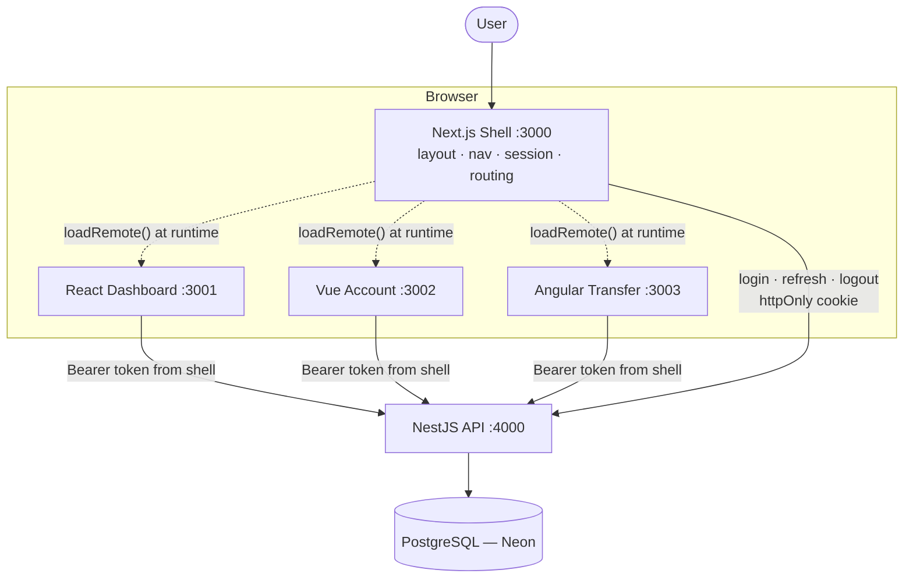
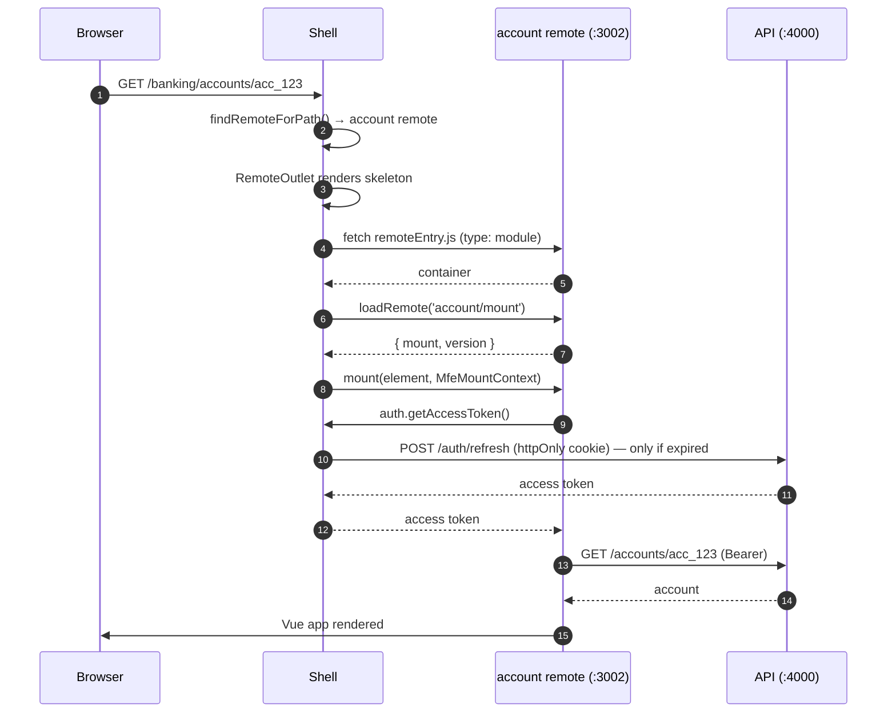
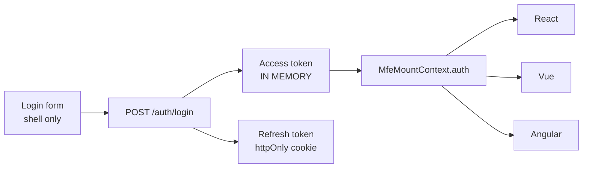

# Northwind Bank — a micro frontend platform

A production-like enterprise banking platform built to demonstrate **micro
frontend architecture**: four browser applications, written in three different
frameworks, developed and deployed independently, composed at runtime into one
product.

```
Next.js Shell  ──►  React Dashboard · Vue Account · Angular Transfer  ──►  NestJS API  ──►  PostgreSQL
```

Every architectural decision here is written down with the alternatives that
were rejected and why — see [`docs/decisions/`](./docs/decisions). Several of
them were changed *because the implementation proved them wrong*, which is
recorded rather than tidied away.

---

## 1. Project overview

| | |
|---|---|
| **Shell** | Next.js 15 (App Router) · React 19 · Tailwind CSS 4 · port 3000 |
| **Dashboard** | React 19 · Vite 6 · TanStack Query · port 3001 |
| **Account** | Vue 3.5 · Vite 6 · Pinia · Vue Query · port 3002 |
| **Transfer** | Angular 20 (zoneless) · Vite + Analog · RxJS · port 3003 |
| **API** | NestJS 11 · Prisma 6 · PostgreSQL (Neon) · port 4000 |
| **Composition** | Module Federation, `@module-federation/enhanced` runtime API |
| **Contracts** | `@banking/contracts` — types, RBAC, events, mount contract |

**Verified working end to end:** 43 automated tests pass — 23 API unit tests, 7
Dashboard component tests, and 13 Playwright tests that drive all five
applications together.

---

## 2. Architecture



The shell owns **layout, navigation, session, routing and global UI**. It owns no
business logic. Each remote owns one domain completely — its data fetching, its
internal routes, its state, its styling.

---

## 3. Why micro frontends? (and when not to)

The single property that justifies the complexity:

> Deploying Transfer v3.0 → v3.1 requires **no rebuild** of the shell, the
> dashboard or the account application.

That is real here, not aspirational: remote URLs are read from the environment at
runtime, so repointing a route at a different build — or rolling one back — is a
config change and a restart.

**What you get:** independent deployment · team autonomy · domain ownership ·
technology independence (three frameworks coexisting is the proof).

**What it costs — honestly:**

- More network requests on first load, and three frameworks on the wire if a
  user visits all three sections ([ADR-006](./docs/decisions/ADR-006-shared-dependencies.md)
  has the measured numbers).
- Runtime failure modes that do not exist in a monolith: a remote can be
  unreachable, mid-deploy, or deployed with a broken contract.
- Debugging spans four applications, which is why every request and every event
  carries a correlation id and a source application.
- Version management becomes an operational concern rather than a `package.json`
  concern.

**A monolith is the right answer** for a single team, a product without
independent release pressure, or anywhere first-load performance dominates. This
architecture buys organisational scaling, and it pays for it in bytes and
operational complexity. Nothing here should be read as "micro frontends are
better".

---

## 4. Repository structure

```
banking-mfe/
├── apps/
│   ├── shell-nextjs/       Next.js host — layout, nav, session, routing, composition
│   ├── dashboard-react/    React remote — balances, spending, recent activity
│   ├── account-vue/        Vue remote — accounts, cards, payees, history
│   ├── transfer-angular/   Angular remote — the transfer wizard and its history
│   ├── api-nestjs/         NestJS — auth, accounts, transactions, beneficiaries, transfers
│   └── e2e-playwright/     Playwright — the only place all five run together
├── packages/
│   ├── contracts/          The shared boundary: API types, RBAC, events, mount contract
│   └── config/             Shared TypeScript and ESLint configuration
└── docs/
    ├── architecture/       How each concern works
    ├── decisions/          ADRs — problem, options, trade-offs, choice, why
    └── diagrams/           Mermaid sources
```

**Why `<domain>-<tech>`.** In a repository whose entire point is that three
frameworks coexist, a folder called `account/` forces you to open a file to
learn what it is. The domain comes first because domain ownership is the primary
division and the framework is a qualifier — `account-vue` is the Account domain,
which happens to be Vue today.

The honest cost: if a team ever rewrites a remote, the folder name goes stale
and renaming it churns every path. That is a real downside, accepted here
because the naming is doing teaching work. A single-framework production
monorepo should name folders by domain alone.

**Why this split.** `apps/` holds independently deployable units — each has its
own `package.json`, build, version, Dockerfile and pipeline. `packages/` holds
what genuinely must be agreed on. Note that `packages/` names carry **no**
technology: `contracts` is deliberately framework-agnostic, and saying so in the
name would be a lie waiting to happen.

**What is deliberately *not* shared:**

- **No shared UI package.** Three frameworks cannot share components, and a
  package that could would force all three to release together. Visual
  consistency comes from the shell owning the chrome and from shared design
  tokens — not from shared code.
- **No shared HTTP client.** Each remote has its own ~40-line `fetch` wrapper
  (Angular uses `HttpClient` because that is idiomatic there). Extracting it
  would couple three release cadences to save forty lines. The *contract* is
  shared; the plumbing that speaks it is not.
- **No shared store.** See [ADR-007](./docs/decisions/ADR-007-server-state.md).

`packages/contracts` is framework-agnostic on purpose — it imports nothing from
React, Vue or Angular, and it is the only dependency all four applications have
in common.

---

## 5. Module Federation: host, remote, runtime loading



Each remote exposes exactly one module:

```ts
// The whole public surface of a remote.
export const mount: MfeMount;   // (element, context) => unmount
export const version: string;
```

The shell registers as a host through the **runtime API** rather than a build
plugin, because it is a Next.js application and `@module-federation/nextjs-mf`
has not kept pace with the App Router. See
[ADR-001](./docs/decisions/ADR-001-host-and-remotes.md) and
[ADR-002](./docs/decisions/ADR-002-mount-contract.md).

### Three things that will bite you

All of these were found by running the thing, not by reading docs
([more detail](./docs/architecture/module-federation.md)):

1. **Vite-built containers are ES modules.** The runtime injects a classic
   `<script>` by default, and the browser rejects the first `import` with
   *"Cannot use import statement outside a module"* — a failure that looks like a
   network problem. Every remote is registered with `type: 'module'`.

2. **Do not share React with a Next.js host.** Next.js pins a *canary* React, so
   a remote's `^19.0.0` range does not match it, the share scope is only
   partially satisfied, and React refuses to render with
   *"Incompatible React versions"* (error #527). The full analysis and the
   measured cost of not sharing is [ADR-006](./docs/decisions/ADR-006-shared-dependencies.md).

3. **The standalone entry must not import from the federation entry.** Two
   routes into a module the plugin is rewriting is a race, and it fails
   *intermittently* with `"mount" is not exported by "src/mount.ts"`. Each remote
   therefore has a `bootstrap.ts` that both `mount.ts` and `main.ts` depend on.

---

## 6. Routing

```
/login                        shell
/banking/dashboard            → React remote
/banking/accounts             → Vue remote
/banking/accounts/:id         → Vue remote (its own internal route)
/banking/transfer             → Angular remote
/banking/transfer/history     → Angular remote (Angular Router)
```

**One owner of the URL: the shell.** Two routers writing to `history` in one page
is the classic micro frontend bug — the host pushes a state the remote does not
recognise, the remote rewrites it, and the back button dies.

Remotes read their slice of the path through `MfeRoute` and request changes via
`navigate()`. The shell serves the whole space from one catch-all route, because
a remote owns URLs the shell cannot enumerate.

| Concern | How it works |
|---|---|
| Deep linking | The path is the real URL; the shell resolves the owning remote by prefix |
| Browser refresh | Session rebuilt from the refresh cookie, remote re-fetched, view restored from the URL |
| Navigation between remotes | Shell `<Link>`; the previous remote is fully unmounted |
| Navigation inside a remote | The remote's own routing, via `navigate()` |
| 404 | No remote owns the prefix → the shell renders it, navigation still works |

**Angular keeps its real `Router`**, wired through a custom
[`ShellLocationStrategy`](./apps/transfer-angular/src/app/core/shell-location.strategy.ts)
that reads the shell's path and delegates navigation back to it. **Vue
deliberately does not use `vue-router`** — a second history-owning router is the
bug, not the feature. [ADR-003](./docs/decisions/ADR-003-communication.md).

---

## 7. Authentication



**One login screen for the platform.** No remote authenticates on its own; they
receive `auth.getAccessToken()` through the mount contract.

| Storage | Survives reload | Readable by XSS |
|---|---|---|
| `localStorage` | yes | **yes** — including by a script injected into *any* remote |
| `sessionStorage` | per tab | **yes** |
| httpOnly cookie | yes | no (but needs CSRF defence) |
| **in memory** ← chosen | no | only while the page lives |

The shell executes JavaScript from three other origins, so a credential in
`localStorage` is readable by all of them in one line. In memory, an XSS payload
can act *while the page is open* but cannot exfiltrate a durable credential.

Also implemented: **refresh token rotation with reuse detection** (a replayed
token revokes every session for that user), **HMAC-hashed token storage**, and
**single-flight refresh** — without which three remotes mounting at once fire
three refreshes, each rotating the cookie, and the platform logs the user out via
its own theft detection. Full reasoning:
[ADR-004](./docs/decisions/ADR-004-authentication.md).

---

## 8. Authorization (RBAC)

```
ADMIN     VIEW_DASHBOARD VIEW_ACCOUNT VIEW_TRANSACTION TRANSFER_MONEY MANAGE_BENEFICIARY MANAGE_USERS
STAFF     VIEW_DASHBOARD VIEW_ACCOUNT VIEW_TRANSACTION
CUSTOMER  VIEW_DASHBOARD VIEW_ACCOUNT VIEW_TRANSACTION TRANSFER_MONEY MANAGE_BENEFICIARY
```

Code checks **permissions, never roles**, so the mapping can change without
touching a guard or a component.

Enforced in three places, and only one of them counts:

1. Shell — hides navigation the user cannot use. *Courtesy.*
2. Remote — Angular's route guard refuses the wizard without `TRANSFER_MONEY`. *Courtesy.*
3. **API — `PermissionsGuard` on every request.** *The control.*

The API re-derives permissions from the persisted role on every request and never
trusts a client-supplied list. There is an end-to-end test that logs in as STAFF
and posts to `/transfers` directly from the browser console; it asserts **403**.

---

## 9. Communication between micro frontends

```
Account MFE ──account:selected──► Shell ──► Transfer MFE
Transfer MFE ──transfer:completed──► Shell ──► Dashboard MFE
```

The complete contract is five events:

```ts
'account:selected' | 'transfer:completed' | 'auth:logout'
'notification:show' | 'navigation:request'
```

A typed facade over the DOM's own `EventTarget` — the transport is `CustomEvent`,
already understood by all three frameworks, requiring no shared runtime. Every
event carries `meta.source` and `meta.correlationId`.

Publishers and subscribers never learn about each other: Angular emits
`transfer:completed` knowing nothing about a dashboard; React invalidates its
cache on that event knowing nothing about Angular. Options considered and
rejected — shared store, props, `postMessage`, URL — are in
[ADR-003](./docs/decisions/ADR-003-communication.md).

---

## 10. State management

| Kind | Examples | Owner |
|---|---|---|
| Global client | user, permissions, locale, theme, notifications | shell → `MfeMountContext` |
| **Server** | accounts, balances, transactions, transfers | a query cache **inside each remote** |
| Local UI | wizard step, pagination, modals, form drafts | the owning component |

**Global state ≠ server state.** Server state is a *cache of someone else's
state*: it goes stale with no local action, and needs invalidation, refetching,
retry and deduplication. A global store means hand-writing all of that badly and
gaining a second source of truth that drifts.

Caches are created **per mount** and cleared on teardown — a module-level cache
would survive a logout and briefly show one user another user's balances.
[ADR-007](./docs/decisions/ADR-007-server-state.md).

---

## 11. CSS isolation

Each remote uses its framework's own mechanism, all enforced by a compiler rather
than by convention:

| Application | Mechanism |
|---|---|
| Shell | Tailwind CSS — and the **only** application that resets `body` |
| Dashboard (React) | CSS Modules — `.root` becomes `_root_1f2x3_1` |
| Account (Vue) | `<style scoped>` — per-component data attributes |
| Transfer (Angular) | Emulated view encapsulation — the framework default |

Global page styles live in each remote's `styles/standalone.css`, imported only
by `main.ts` and **never** by `mount.ts` — so nothing global travels with the
federated remote. A remote that reset `body` would be restyling the shell and its
two siblings.

---

## 12. Error isolation

```
Dashboard ❌ ──► Shell ──► Account ✅
                     └──► Transfer ✅
```

Because each remote mounts into its own framework root, a crash inside one cannot
propagate into the shell's React tree — the isolation is structural. (A React
error boundary in the shell would in fact *not* catch it; a subtlety worth
knowing.)

`RemoteOutlet` models five states, not three: **loading · ready · timeout ·
unavailable · invalid-contract**, each with a retry. The 10-second timeout
matters more than it looks — without it an unreachable origin leaves
`loadRemote()` pending forever, and a spinner that never resolves is worse than
an error with a button. [ADR-005](./docs/decisions/ADR-005-error-isolation.md).

---

## 13. Performance — measured, not asserted

Real gzipped output from `pnpm build`:

| Bundle | gzip |
|---|---|
| Shell first-load JS (shared chunks) | ~251 kB |
| `remoteEntry.js` (each remote) | ~5.5 kB |
| dashboard, all chunks | ~99 kB |
| account, all chunks | ~70 kB |
| transfer, all chunks | ~129 kB |

**Versus a monolith.** A user who visits all three sections downloads three
frameworks. A monolith ships one. That is a genuine regression and is bought with
independent deployment, not with speed.

What is actually done about it:

- Remotes load **lazily** — only on first navigation to their section, so the
  landing experience costs one remote, not three.
- `remoteEntry.js` is ~5.5 kB, so discovery is cheap; the payload follows only if
  the user goes there.
- Each remote code-splits its own routes (Angular's history view is a separate
  chunk from its wizard).
- Caches are **independent**: a Dashboard release does not invalidate Angular's
  bundle. A monolith's single hashed bundle invalidates everything on every
  release — the one place this architecture wins on bytes over time.

---

## 14. Security

The defining risk of this architecture: **the shell executes JavaScript it did
not build.** If a remote's origin is compromised, the attacker gets full
execution in the banking page — same-origin, same DOM, same session.

Mitigations actually implemented:

| Threat | Mitigation |
|---|---|
| Malicious remote code | CSP `script-src` enumerates exactly the three remote origins; nothing else can execute |
| Token theft via XSS | Access token in memory only; refresh token httpOnly ([ADR-004](./docs/decisions/ADR-004-authentication.md)) |
| Stolen refresh cookie | Rotation on every use + reuse detection revokes all sessions |
| Stolen database | Refresh tokens stored as HMAC digests, passwords bcrypt cost 12 |
| Clickjacking | `frame-ancestors 'none'` + `X-Frame-Options: DENY` |
| CSRF | Refresh cookie scoped to `/auth`; explicit CORS origin allowlist (wildcard + credentials is impossible) |
| Privilege escalation via body | `ValidationPipe` with `whitelist` + `forbidNonWhitelisted` strips and rejects unknown fields such as `role` |
| IDOR | Every repository query filters by `userId` in the `where` clause, so the query *cannot* return another customer's row |
| Account enumeration | Login returns one error for "no such user" and "wrong password" |
| Brute force | Rate limits on login and transfer, configurable per environment |
| Data over-exposure | Account numbers masked at the mapper; a new DB column can never silently ship to a browser |

**Not yet done (would be required for real production):** Subresource Integrity
or signed remote manifests, a per-request CSP nonce instead of
`'unsafe-inline'`, and provenance verification of remote builds.

---

## 15. Testing

| Level | Where | What |
|---|---|---|
| Unit | `apps/api` — Jest | Transfer policy, fee boundaries, money conversion, pagination, spending aggregation |
| Component | `apps/dashboard` — Vitest + Testing Library | Loading / empty / error / success, retry, event emission, auth headers |
| End-to-end | `apps/e2e` — Playwright | Composition, routing, communication, RBAC across all five applications |

```bash
pnpm test                 # unit + component — safe to run with nothing started
pnpm --filter @banking/e2e-playwright install:browsers
pnpm test:e2e             # requires the platform to be running
```

The E2E suite deliberately **does not start the applications**. A micro frontend
platform's integration risk lives in composition — the wrong remote URL, a stale
container, a mismatched contract — and booting everything from inside the runner
would hide exactly those failures. It runs against whatever is deployed, which
also makes it usable as a post-deploy smoke test.

The suite signs in far more often than a human does, so run the API with raised
limits for it:

```bash
AUTH_LOGIN_RATE_LIMIT=200 TRANSFER_RATE_LIMIT=100 pnpm --filter @banking/api-nestjs start
```

---

## 16. Running it

**Full guide: [`docs/RUNNING.md`](./docs/RUNNING.md)** — setup, the four ways to
run it, everyday commands, and a troubleshooting section covering every failure
hit while building this.

The short version:

```bash
pnpm install
pnpm --filter @banking/contracts build

cp apps/api-nestjs/.env.example       apps/api-nestjs/.env      # set DATABASE_URL
cp apps/shell-nextjs/.env.example     apps/shell-nextjs/.env.local
cp apps/dashboard-react/.env.example  apps/dashboard-react/.env
cp apps/account-vue/.env.example      apps/account-vue/.env
cp apps/transfer-angular/.env.example apps/transfer-angular/.env

pnpm db:migrate && pnpm db:seed
pnpm dev                       # all five, via Turborepo
```

| Application | URL |
|---|---|
| Shell — **start here** | http://localhost:3000 |
| Dashboard (standalone) | http://localhost:3001 |
| Account (standalone) | http://localhost:3002 |
| Transfer (standalone) | http://localhost:3003 |
| API | http://localhost:4000 |

**Demo accounts** — password `Password123!`:

| Email | Role | Can transfer? |
|---|---|---|
| `customer@bank.test` | CUSTOMER | yes |
| `staff@bank.test` | STAFF | **no** — use this to see RBAC work |
| `admin@bank.test` | ADMIN | yes |

### Standalone development

Every remote runs on its own port against the real API, using a small stand-in
for the shell (`src/dev/standalone-context.ts`) that implements the same
`MfeMountContext` — including routing, so standalone mode cannot quietly diverge
from the composed one.

This is a first-class requirement, not a convenience: the team owning a domain
must be able to work without booting the rest of the platform, and it is the
fastest way to tell whether a bug is theirs or the shell's.

## 17. Production topology

Nothing assumes co-location:

```
https://bank.example.com        shell
https://dashboard.example.com   dashboard remote
https://account.example.com     account remote
https://transfer.example.com    transfer remote
https://api.example.com         API
```

The shell reads remote URLs from the environment at runtime, so a deploy is:
publish the new `remoteEntry.js`, and — if the URL changed — update one variable
and restart the shell. No shell rebuild.

```mermaid
graph LR
    subgraph "Independent pipelines"
        P1[shell CI] --> D1[bank.example.com]
        P2[dashboard CI] --> D2[dashboard.example.com]
        P3[account CI] --> D3[account.example.com]
        P4[transfer CI] --> D4[transfer.example.com]
        P5[api CI] --> D5[api.example.com]
    end
    D1 -. remoteEntry.js at runtime .-> D2
    D1 -. remoteEntry.js at runtime .-> D3
    D1 -. remoteEntry.js at runtime .-> D4
    D2 --> D5
    D3 --> D5
    D4 --> D5
```

### A note on the monorepo

`gudies.md` asks for separate repositories. This uses a pnpm workspace, which is
a deliberate trade-off: it makes the contract package and the cross-cutting E2E
suite far easier to work on, at the cost of making it *possible* to create
coupling that a poly-repo would make impossible.

Independent deployment is preserved by construction — separate builds, separate
versions, separate artefacts, and (in Phase 5) separate pipelines with path
filters. The discipline a poly-repo enforces mechanically has to be enforced by
review here. That is the honest statement of the trade.

---

## 18. Observability

Every request carries `x-request-id` and `x-application-id`, and the API logs one
structured line per request:

```json
{"requestId":"abc-123","application":"transfer","userId":"usr_1",
 "method":"POST","path":"/transfers","durationMs":42}
```

Every error response carries the same `requestId`, and the UI **shows it** — so a
user's screenshot is enough to find the log line. Every platform event carries
`meta.source` and `meta.correlationId`, without which a dashboard that refreshed
itself looks like a bug rather than a response to something three applications
away.

---

## 19. Status and what is next

**Done and verified (Phases 1–4):** runtime composition · routing and deep
linking · the event contract · authentication with rotation · RBAC enforced
server-side · the full NestJS API on PostgreSQL · error isolation · 43 passing
tests.

**Phase 5 — not in this iteration:** Dockerfiles per application, `docker-compose`,
an Nginx reverse proxy, and a GitHub Actions workflow per application with path
filters (`infra/` and `.github/` are intentionally absent rather than present and
empty).

**Phase 6:** SSR for remotes, remote version pinning and rollback, contract
testing between shell and remotes, Subresource Integrity for remote entries.

---

## 20. Reading order

To **run** it: [`docs/RUNNING.md`](./docs/RUNNING.md).

To understand the architecture, in this order:

1. [`packages/contracts/src/shell.ts`](./packages/contracts/src/shell.ts) — the boundary everything else is built around
2. [`packages/contracts/src/events.ts`](./packages/contracts/src/events.ts) — the complete cross-application API
3. [`apps/shell-nextjs/components/layout/remote-outlet.tsx`](./apps/shell-nextjs/components/layout/remote-outlet.tsx) — the entire integration surface
4. [`apps/shell-nextjs/lib/federation/runtime.ts`](./apps/shell-nextjs/lib/federation/runtime.ts) — host registration, and why nothing is shared
5. [`apps/transfer-angular/src/app/core/shell-location.strategy.ts`](./apps/transfer-angular/src/app/core/shell-location.strategy.ts) — embedding a framework router in a host-owned URL
6. [`docs/decisions/`](./docs/decisions) — the seven ADRs, in order
